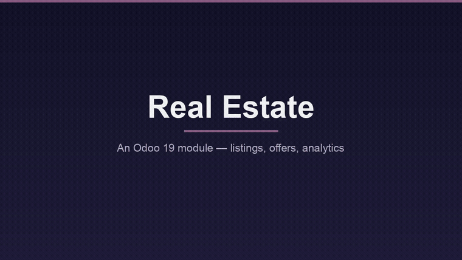
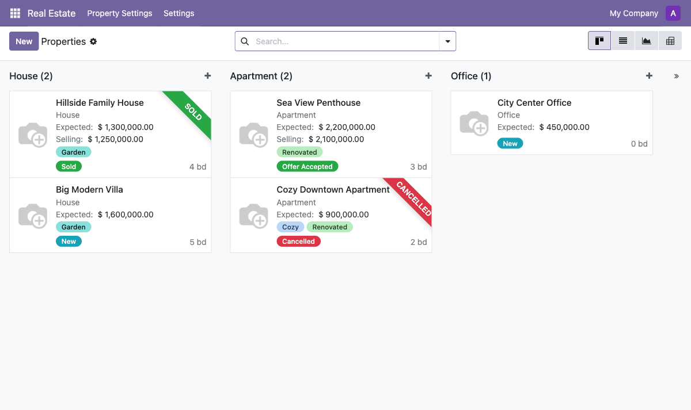
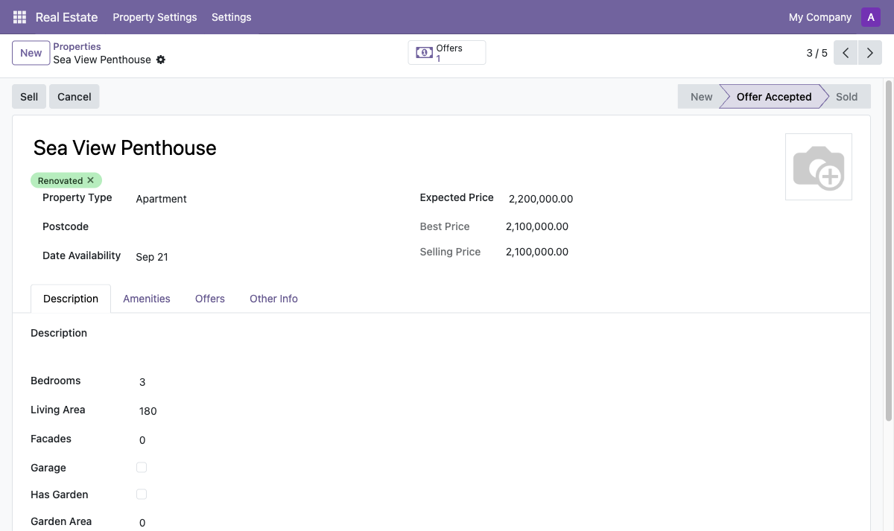
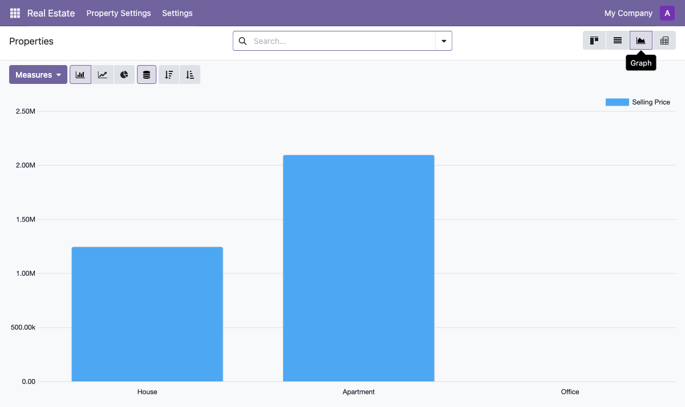
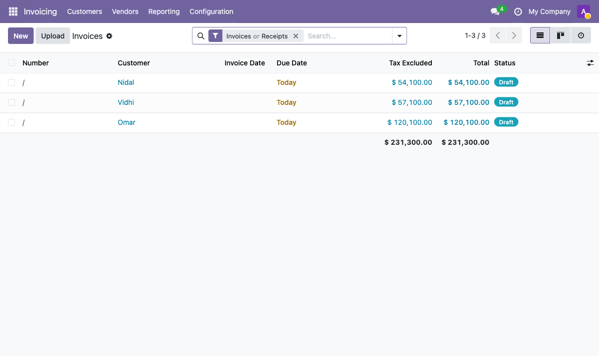
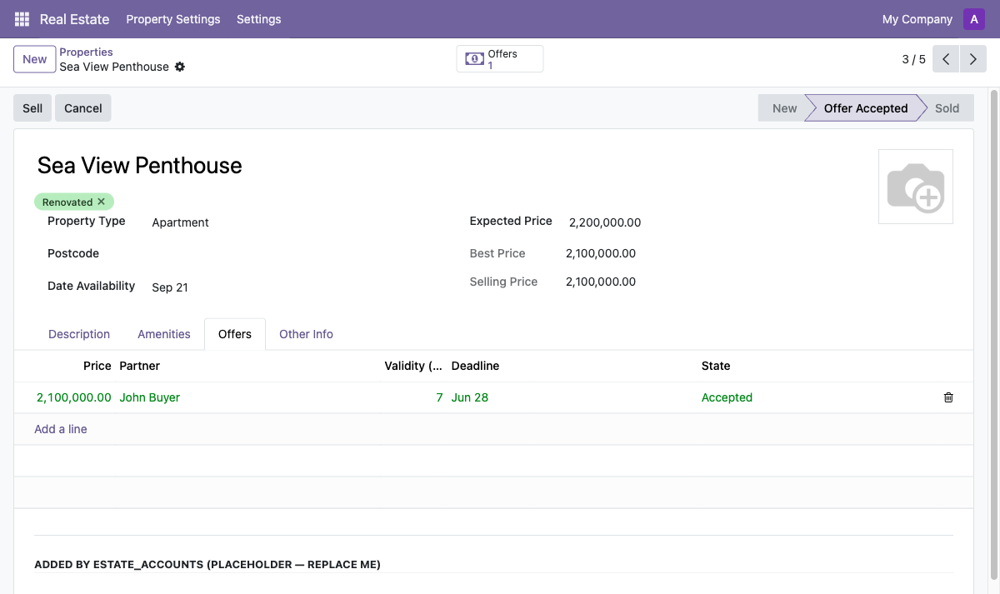
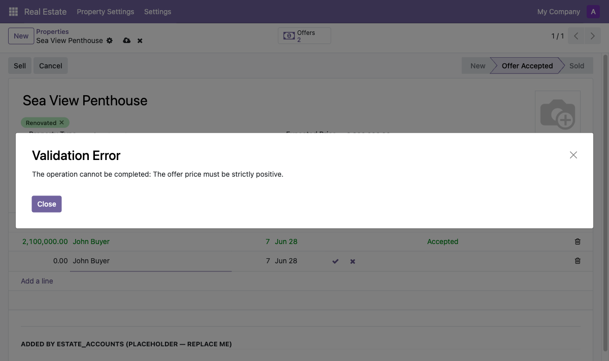
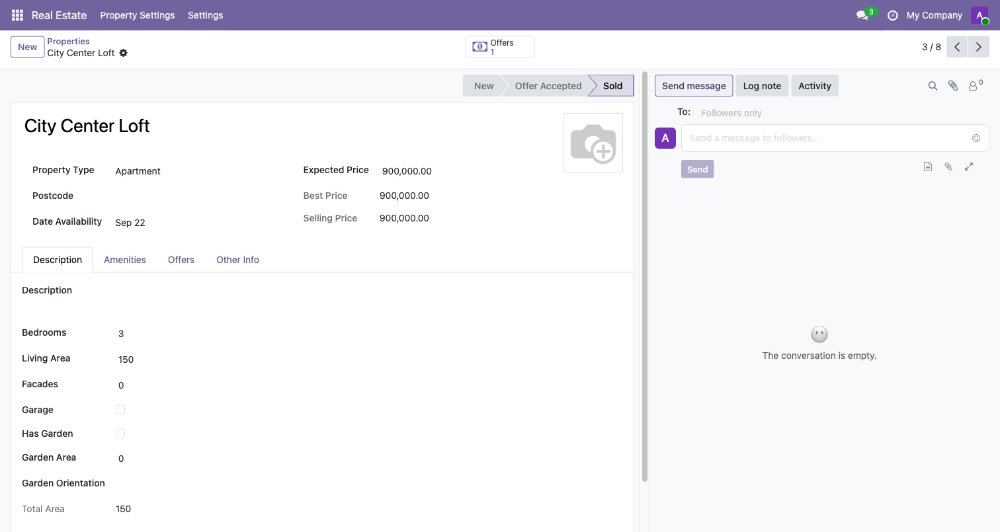
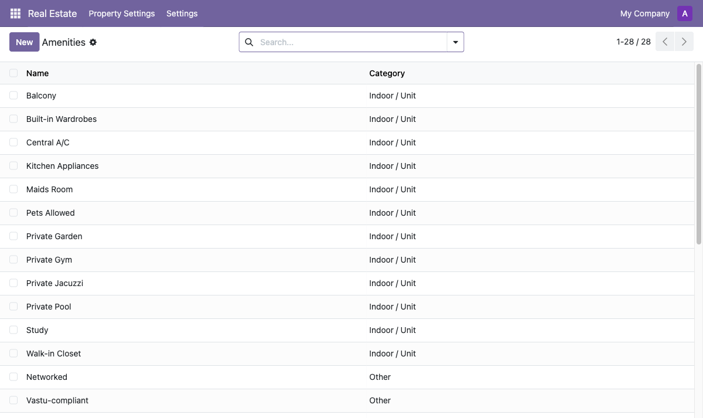

<h1 align="center">🏡 Real Estate — Odoo 19</h1>

<p align="center">
  A complete, production-grade property-management module for Odoo 19 —<br/>
  listings, offers, a full sale lifecycle, automatic invoicing, analytics, and role-based security.
</p>

<p align="center">
  
  
  
  
  
</p>

<p align="center">
  
</p>

---

## ✨ Overview

This project turns the official Odoo *“Server Framework 101”* tutorial into a polished, end-to-end application. A property moves through a clean state machine — **New → Offer Received → Offer Accepted → Sold** (or Cancelled) — and a sale automatically raises a **customer invoice** in Odoo Accounting. It ships with a visual Kanban board, built-in analytics, a PDF brochure, sample data, and an Agent/Manager security model.

It is built as **two modules**:

| Module | Responsibility |
|---|---|
| [`estate`](estate/) | The core domain — properties, types, tags, amenities, offers, views, security, reporting |
| [`estate_accounts`](estate_accounts/) | Thin bridge that bills the buyer (creates an invoice) when a property is sold |

---

## 🎯 Features

**Lifecycle & business logic**
- 🔄 Status-bar state machine with **Sell** / **Cancel** actions and guards
- 🤝 Offers with **Accept / Refuse** — accepting one locks the selling price and **auto-refuses the rest**
- 🧮 Computed fields — total area, best offer, offer count
- ✅ Validation — `models.Constraint` (price > 0), `@api.constrains` (selling ≥ 90% of expected), delete-guard

**Interface**
- 🗂️ **Kanban** board (grouped by type, colour-coded, ribbons), List, rich Form
- 📊 **Graph + Pivot** analytics out of the box
- 🖼️ Property images, monetary pricing, smart **“Offers”** button, many2many tags & checkboxes

**Accounting**
- 🧾 Selling a property **auto-creates a customer invoice** (6% commission + admin fee) via Odoo `account`

**Security**
- 👥 **Agent** vs **Manager** roles (`res.groups.privilege`) — agents see only their own listings; managers see all

**Reporting & data**
- 📄 QWeb **PDF “Property Sheet”** in the Print menu
- 🌱 Sample data (properties in multiple states, 3 types, tags, **28 amenities**)

**Advanced (Odoo 19 power features)**
- 💬 **Chatter, activities & field-tracking** (`mail.thread`) — messaging, scheduled follow-ups, and an audit trail on state / selling-price / buyer changes
- ⏰ **Scheduled automation** (`ir.cron`) — auto-expires offers past their deadline
- 🧙 **Wizard** (`TransientModel`) — a “Make an Offer” dialog launched from the property form
- 🎨 **Custom SCSS** kanban polish (card elevation, state-accent borders) + a `country_id` with flag

---

## 📸 Screenshots

| Kanban pipeline | Property form |
|:--:|:--:|
|  |  |
| **Analytics (Graph)** | **Auto-generated invoices** |
|  |  |
| **Offers & negotiation** | **Validation** |
|  |  |
| **Chatter & activities** | **Amenities catalogue** |
|  |  |

▶️ Full demo video: [`docs/demo.mp4`](docs/demo.mp4)

---

## 🧱 Data model

```
res.partner ──┐                         estate.property.type ──1:N── estate.property
              │ (buyer)                 estate.property.tag  ──M:N── estate.property
res.users  ───┤ (salesperson)           estate.property.amenity M:N─ estate.property
              │                                                       │ 1:N
              └─────────────── estate.property.offer ◄────────────────┘ (offers)
```

| Model | Purpose | Key relations |
|---|---|---|
| `estate.property` | A property listing | `Many2one` type/buyer/agent · `One2many` offers · `Many2many` tags & amenities |
| `estate.property.type` | Category (House, Apartment…) | `One2many` properties |
| `estate.property.tag` | Marketing labels | `Many2many` |
| `estate.property.amenity` | Feature catalogue (28 items) | `Many2many` |
| `estate.property.offer` | A buyer’s bid | `Many2one` property & partner |
| `res.users` *(extended)* | Adds the agent’s properties | `One2many` |

---

## 🚀 Installation

> Requires Odoo 19, Python 3.12+, PostgreSQL 12+.

```bash
# 1. Put both modules on your Odoo addons path
cp -R estate estate_accounts /path/to/your/addons/

# 2. Install (estate_accounts pulls in Accounting automatically)
./odoo-bin -c odoo.conf -d mydb -i estate,estate_accounts

# 3. Open the app
#    http://localhost:8069  →  Real Estate
```

Then enable Developer Mode to explore the Graph/Pivot views and the PDF report.

---

## 🗂️ Project structure

```
real-estate-odoo/
├── estate/                      # core module
│   ├── models/                  #   property, type, tag, amenity, offer, res.users
│   ├── views/                   #   kanban, list, form, graph, pivot, search, menus
│   ├── security/                #   groups, record rules, access rights
│   ├── report/                  #   QWeb PDF property sheet
│   └── data/                    #   sample types, tags, amenities, listings
├── estate_accounts/             # invoicing bridge (depends on `account`)
│   └── models/estate_property.py#   overrides sell → creates account.move
└── docs/                        # demo video, gif, screenshots
```

---

## 🛠️ Tech stack

**Odoo 19.0** · **Python 3.12** · **PostgreSQL 16** · QWeb · Owl/Kanban

Demonstrates: ORM models & relations, computed/related fields, `@api.depends` / `@api.onchange` / `@api.constrains`, `models.Constraint`, action methods, view inheritance (`xpath`), cross-module model inheritance, record rules & groups, and QWeb reporting.

---

## 📝 License

Released under the **LGPL-3.0** license — see [`LICENSE`](LICENSE).

<p align="center"><sub>Built during an advanced Odoo bootcamp · Odoo 19</sub></p>
